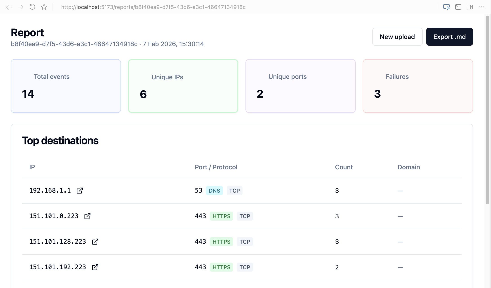

# EgressLens

Trace outbound network activity from Python apps in Docker, write the events as JSONL, and inspect the results in a small web UI.

[](LICENSE)
[](https://www.python.org/downloads/)
[](https://www.docker.com/)

## What It Does

EgressLens runs an app under `strace`, captures IPv4 network syscalls, and produces:

- `egress.jsonl`: parsed connection events
- `egress.strace`: raw trace output
- `run.json`: command, image, timing, exit code, and event counts

The backend can enrich uploaded reports with domains from passive DNS seen in the trace, then bounded reverse DNS for unresolved public IPv4 addresses.

You can also tell EgressLens which destinations an app is expected to reach. Give it an allowlist and it flags anything off the list, with a clear pass/fail verdict on the report. See [Egress Policy](#egress-policy).

## Quick Start

Requirements: Docker 20.10+, Python 3.9+, and Node.js 18+ for the UI.

```bash
pip install -e cli/
docker build -t egresslens/base:latest .
egresslens run-app ./sample_app --args "dns example.com"
```

Output lands in `egresslens-output/`.

## Demo

Run the repeatable live demo and browser recording flow with [docs/demo.md](docs/demo.md).

## View A Report

Start the API:

```bash
cd backend
python3 -m venv .venv
source .venv/bin/activate
pip install -r requirements.txt
uvicorn app.main:app --reload --port 8000
```

Start the UI:

```bash
cd frontend
npm install
npm run dev
```

Open `http://localhost:5173` and upload:

- `egresslens-output/egress.jsonl` as the report
- `egresslens-output/run.json` for metadata
- `egresslens-output/egress.strace` for domain enrichment
- an optional `policy.json` allowlist (see [Egress Policy](#egress-policy))



## Egress Policy

Upload an allowlist alongside a report to turn it into a verdict: every observed
destination is checked against the policy, and anything that does not match is
reported as unexpected. The report gets a **PASS/FAIL** verdict, and a failing
verdict raises a high-severity "Unexpected destinations" flag (also included in
the markdown export).

The policy is a JSON file with an `allow` list. Each entry is either a shorthand
string or an object:

```json
{
  "allow": [
    "*.github.com",
    "pypi.org",
    "140.82.112.0/20",
    { "domain": "files.pythonhosted.org" },
    { "ip": "151.101.0.0/16", "port": 443 }
  ]
}
```

- A **domain** matches exactly (`pypi.org`), or as a leading-wildcard covering
  subdomains only (`*.github.com` matches `api.github.com`, not the apex or
  `notgithub.com`).
- An **ip** is a single address or a CIDR range.
- An object rule may add a **port**; every field it declares must match.

A destination is expected if an `ip`/CIDR rule covers it, or — when it resolved
to one or more domains — if **every** observed domain matches a rule. That last
part fails closed on purpose: a shared IP that served both an allowed and a
disallowed name is reported as unexpected rather than passing on the allowed one.
Destinations that could not be named (unresolved IPs) match `ip`/CIDR rules only.

**Trust model.** `ip`/CIDR rules match the real `connect()` destination and are a
hard gate. `domain` rules match the name attributed during enrichment, which is
derived from DNS answers seen in the traced process's *own* trace — so code that
is actively trying to evade the allowlist could forge that attribution. Treat
`domain` rules as advisory (great for catching accidental or non-adversarial
egress drift) and use `ip`/CIDR rules where you need a verdict that the traced
code cannot influence.

The policy verdict is independent of the other flags: an allowlisted destination
on an uncommon port can still raise the "Unusual ports" flag, so a report may
show a **PASS** verdict alongside other flags.

## CLI

Trace a Python project with an entry point named `__main__.py`, `main.py`, or `app.py`:

```bash
egresslens run-app ./my_python_app --args "arg1 arg2"
```

Trace an arbitrary command:

```bash
egresslens watch -- curl https://example.com
```

Useful options:

- `--out <path>`: write output somewhere else
- `--image <name>`: use a different image with `strace` installed

More detail: [cli/README.md](cli/README.md).

## Repo Map

- `cli/`: capture network activity and write trace artifacts
- `backend/`: FastAPI upload, aggregation, enrichment, and export API
- `frontend/`: React UI for uploads and reports
- `sample_app/`: small app for predictable demo traffic
- `docs/getting-started.md`: longer walkthrough with screenshots

## Security Model

Tracing requires Docker settings that reduce isolation:

- `--cap-add SYS_PTRACE`
- `--security-opt seccomp=unconfined`

The CLI still mounts the app read-only, drops other capabilities, uses `no-new-privileges`, and provides tmpfs scratch space. Treat traced code as code you are choosing to run.

## Limits

- IPv4 only. IPv6 connections are counted (reported as `ipv6_connects_skipped`) but their destinations are not captured.
- Domain enrichment sees UDP DNS A-record answers in `egress.strace`; it does not cover DNS-over-HTTPS, DNS-over-TLS, cached DNS, TCP DNS, AAAA records, or IPv6.
- Reverse DNS fallback skips private and non-routable IP ranges and is capped by backend configuration.
- Policy `domain` rules only match destinations that were named during enrichment, so include `egress.strace` when using them; unresolved IPs can still be covered with `ip`/CIDR rules.

## License

MIT. See [LICENSE](LICENSE).
