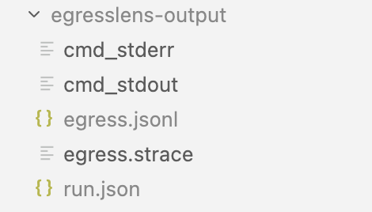
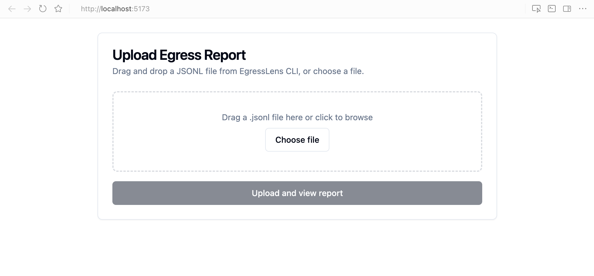
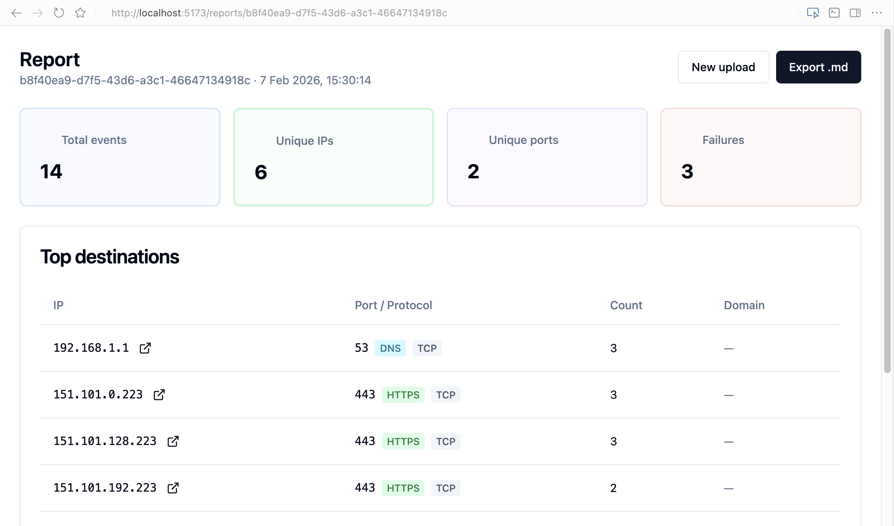

# Getting started: example flow (Sample app + UI)

This walkthrough follows the full flow: start backend, start frontend, run the CLI, upload the JSONL, and view results in the UI.

## Prerequisites

- Docker 20.10+
- Python 3.8+
- Node.js 18+

## Step 1: Start the backend

```bash
cd backend
python3 -m venv .venv
source .venv/bin/activate
pip install -r requirements.txt
uvicorn app.main:app --reload --port 8000
```

Leave this terminal running. The API will be available at `http://localhost:8000`.

## Step 2: Start the frontend

```bash
cd frontend
npm install
npm run dev
```

Open the UI at `http://localhost:5173`.

## Step 3: Go to the CLI directory and activate the venv

```bash
cd cli
python3 -m venv .venv
source .venv/bin/activate
pip install -r requirements.txt
```

## Step 4: Run a CLI capture

From the repo root:

```bash
egresslens run-app ./sample_app --args "dns example.com"
```

Example:

```
 $ egresslens run-app ./sample_app --args "all python.org"

✓ Run complete (exit code: 0)
  Run ID: 2e79c74f-d012-4028-b5a6-0ae3630df627
  Output: /workspaces/egresslens/egresslens-output
  Events: 14 network events captured
  Unique destinations: 6 IPs, 6 IP:port pairs
  Dependencies: Installed from requirements.txt

```


Note: here we're using the sample app included in this repo.


## Step 5: Review the generated files




The run creates `egresslens-output/` with:

- `egress.jsonl` - network events

Sample:

```json
{"ts": 1770477764.27391, "pid": 12, "event": "connect", "family": "inet", "proto": "tcp", "dst_ip": "192.168.1.1", "dst_port": 53, "result": "ok", "errno": null}
{"ts": 1770477764.279734, "pid": 12, "event": "connect", "family": "inet", "proto": "tcp", "dst_ip": "151.101.128.223", "dst_port": 443, "result": "ok", "errno": null}
{"ts": 1770477764.280498, "pid": 12, "event": "connect", "family": "inet", "proto": "tcp", "dst_ip": "151.101.192.223", "dst_port": 443, "result": "ok", "errno": null}
{"ts": 1770477764.28121, "pid": 12, "event": "connect", "family": "inet", "proto": "tcp", "dst_ip": "151.101.0.223", "dst_port": 443, "result": "ok", "errno": null}
```


- `egress.strace` - captured `strace` outputs

Sample:

```log
12    1770477764.115770 connect(3, {sa_family=AF_INET, sin_port=htons(53), sin_addr=inet_addr("192.168.1.1")}, 16) = 0
12    1770477764.116208 sendmmsg(3, [{msg_hdr={msg_name=NULL, msg_namelen=0, msg_iov=[{iov_base="N\247\1\0\0\1\0\0\0\0\0\0\4pypi\3org\0\0\1\0\1", iov_len=26}], msg_iovlen=1, msg_controllen=0, msg_flags=0}, msg_len=26}, {msg_hdr={msg_name=NULL, msg_namelen=0, msg_iov=[{iov_base="k\246\1\0\0\1\0\0\0\0\0\0\4pypi\3org\0\0\34\0\1", iov_len=26}], msg_iovlen=1, msg_controllen=0, msg_flags=0}, msg_len=26}], 2, MSG_NOSIGNAL) = 2
12    1770477764.116825 recvfrom(3, "k\246\201\200\0\1\0\0\0\0\0\0\4pypi\3org\0\0\34\0\1", 2048, 0, {sa_family=AF_INET, sin_port=htons(53), sin_addr=inet_addr("192.168.1.1")}, [28 => 16]) = 26
12    1770477764.117768 recvfrom(3, "N\247\201\200\0\1\0\4\0\0\0\0\4pypi\3org\0\0\1\0\1\4pypi\3org\0\0\1\0\1\0\0\0\0\0\4\227e\0\337\4pypi\3org\0\0\1\0\1\0\0\0\0\0\4\227e\300\337\4pypi\3org\0\0\1\0\1\0\0\0\0\0\4\227e@\337\4pypi\3org\0\0\1\0\1\0\0\0\0\0\4\227e\200\337", 65536, 0, {sa_family=AF_INET, sin_port=htons(53), sin_addr=inet_addr("192.168.1.1")}, [28 => 16]) = 122
12    1770477764.118570 socket(AF_NETLINK, SOCK_RAW|SOCK_CLOEXEC, NETLINK_ROUTE) = 3
12    1770477764.118818 bind(3, {sa_family=AF_NETLINK, nl_pid=0, nl_groups=00000000}, 12) = 0
12    1770477764.120403 getsockname(3, {sa_family=AF_NETLINK, nl_pid=12, nl_groups=00000000}, [12]) = 0
```


- `run.json` - run metadata
- `cmd_stdout` - app stdout
- `cmd_stderr` - app stderr


#### Preview a few events:

```bash
$ head -n 5 egresslens-output/egress.jsonl
{"ts": 1770477764.11577, "pid": 12, "event": "connect", "family": "inet", "proto": "tcp", "dst_ip": "192.168.5.1", "dst_port": 53, "result": "ok", "errno": null}
{"ts": 1770477764.122074, "pid": 12, "event": "connect", "family": "inet", "proto": "tcp", "dst_ip": "151.101.0.223", "dst_port": 443, "result": "ok", "errno": null}
{"ts": 1770477764.122886, "pid": 12, "event": "connect", "family": "inet", "proto": "tcp", "dst_ip": "151.101.192.223", "dst_port": 443, "result": "ok", "errno": null}
```


## Step 6: Upload the JSONL in the UI

Use the upload page (frontend app) to submit `egresslens-output/egress.jsonl`.




## Step 7: View the results in the UI

After upload, the report page shows the KPIs, timeline, and top destinations.



