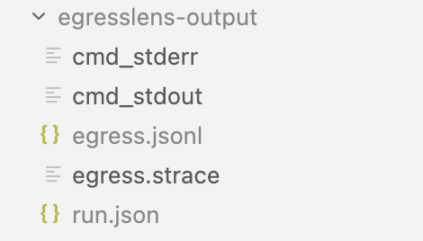
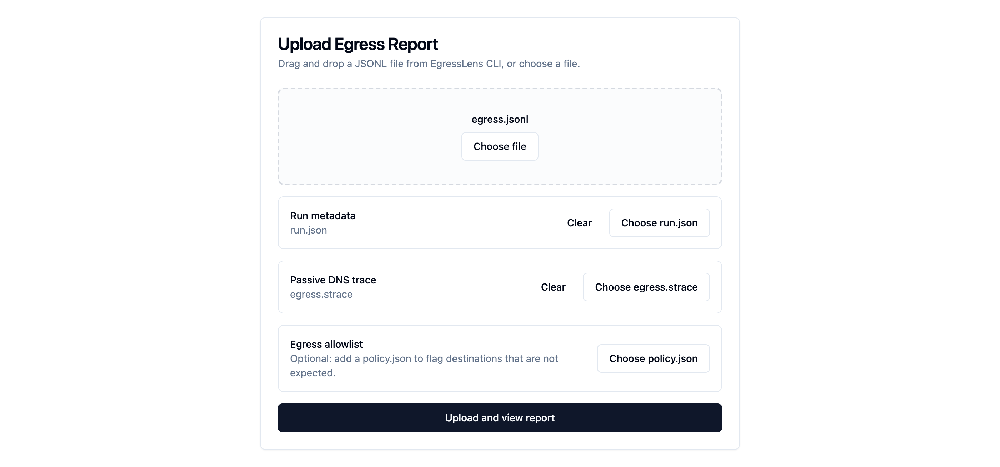
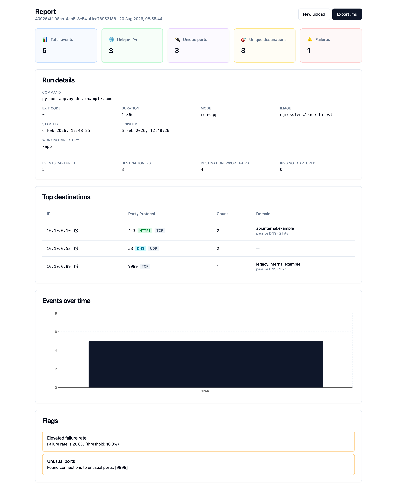

# Getting started: example flow (Sample app + UI)

This walkthrough follows the full flow: start backend, start frontend, run the CLI, upload the JSONL, and view results in the UI.

## Prerequisites

- Docker 20.10+
- Python 3.9+ for the CLI, 3.10+ for the backend
- Node.js 20.19+ (or 22.13+)

## Step 1: Start the backend

```bash
cd backend
python3 -m venv .venv
source .venv/bin/activate
pip install -r requirements.txt
pip install -e ../cli
uvicorn app.main:app --reload --port 8000
```

`pip install -e ../cli` is required, not an extra: the policy and enrichment
engine lives in the `egresslens` package and the backend re-exports it.

Leave this terminal running. The API will be available at `http://localhost:8000`.

## Step 2: Start the frontend

```bash
cd frontend
npm install
npm run dev
```

Open the UI at `http://localhost:5173`.

## Step 3: Install the CLI

In a third terminal, from the repo root:

```bash
python3 -m venv .venv
source .venv/bin/activate
pip install -e cli/
```

`pip install -e cli/` is what creates the `egresslens` command. Installing
`cli/requirements.txt` on its own gets you the dependencies but no command.

## Step 4: Build the tracing image

From the repo root:

```bash
docker build -t egresslens/base:latest .
```

The CLI defaults to this local image.

## Step 5: Run a CLI capture

From the repo root:

```bash
egresslens run-app ./sample_app --args "dns example.com"
```

Example:

```
 $ egresslens run-app ./sample_app --args "all example.com"

✓ Run complete (exit code: 0)
  Run ID: 3af979a5-e907-411f-bff2-ba6dbc3f6959
  Output: /workspaces/egresslens/egresslens-output
  Events: 5 network events captured
  Unique destinations: 2 IPs, 2 IP:port pairs
  Dependencies: Installed from requirements.txt before tracing started
                (pip's own egress is not in this report; output in pip_install.log)

```


Note: here we're using the sample app included in this repo.

The `requirements.txt` install finishes before `strace` starts, so PyPI and its
CDN are not in the capture. Otherwise every run of an app with dependencies
would report pip's downloads as the app's own egress.


## Step 6: Review the generated files




The run creates `egresslens-output/` with:

- `egress.jsonl` - network events

Sample:

```json
{"ts": 1787221162.100912, "pid": 14, "event": "sendto", "family": "inet", "proto": "udp", "dst_ip": "192.168.65.7", "dst_port": 53, "result": "ok", "errno": null}
{"ts": 1787221162.104651, "pid": 14, "event": "sendto", "family": "inet", "proto": "udp", "dst_ip": "192.168.65.7", "dst_port": 53, "result": "ok", "errno": null}
{"ts": 1787221162.105824, "pid": 14, "event": "sendto", "family": "inet", "proto": "udp", "dst_ip": "192.168.65.7", "dst_port": 53, "result": "ok", "errno": null}
{"ts": 1787221162.162485, "pid": 14, "event": "connect", "family": "inet", "proto": "tcp", "dst_ip": "91.199.212.73", "dst_port": 443, "result": "error", "errno": "EINPROGRESS"}
```

`event` records which syscall named the destination: `connect`, or `sendto` /
`sendmsg` / `sendmmsg` for a datagram sent on an unconnected socket. See
[Which syscalls are parsed](#which-syscalls-are-parsed).


- `egress.strace` - captured `strace` outputs

Sample:

```log
14    1787221162.111354 connect(3, {sa_family=AF_INET, sin_port=htons(53), sin_addr=inet_addr("192.168.65.7")}, 16) = 0
14    1787221162.111505 sendmmsg(3, [{msg_hdr={msg_name=NULL, msg_namelen=0, msg_iov=[{iov_base="\5%\1\0\0\1\0\0\0\0\0\0\3crt\2sh\0\0\1\0\1", iov_len=24}], msg_iovlen=1, msg_controllen=0, msg_flags=0}, msg_len=24}, {msg_hdr={msg_name=NULL, msg_namelen=0, msg_iov=[{iov_base="\n$\1\0\0\1\0\0\0\0\0\0\3crt\2sh\0\0\34\0\1", iov_len=24}], msg_iovlen=1, msg_controllen=0, msg_flags=0}, msg_len=24}], 2, MSG_NOSIGNAL) = 2
14    1787221162.112529 recvfrom(3, "\n$\201\200\0\1\0\0\0\0\0\0\3crt\2sh\0\0\34\0\1", 2048, 0, {sa_family=AF_INET, sin_port=htons(53), sin_addr=inet_addr("192.168.65.7")}, [28 => 16]) = 24
14    1787221162.161731 recvfrom(3, "\5%\201\200\0\1\0\1\0\0\0\0\3crt\2sh\0\0\1\0\1\3crt\2sh\0\0\1\0\1\0\0\10\20\0\4[\307\324I", 65536, 0, {sa_family=AF_INET, sin_port=htons(53), sin_addr=inet_addr("192.168.65.7")}, [28 => 16]) = 46
14    1787221162.162083 socket(AF_INET, SOCK_STREAM|SOCK_CLOEXEC, IPPROTO_TCP) = 3
14    1787221162.162485 connect(3, {sa_family=AF_INET, sin_port=htons(443), sin_addr=inet_addr("91.199.212.73")}, 16) = -1 EINPROGRESS (Operation now in progress)
```


- `run.json` - run metadata
- `cmd_stdout` - app stdout
- `cmd_stderr` - app stderr
- `pip_install.log` - the untraced dependency install's output, kept out of
  `cmd_stdout`/`cmd_stderr` so those hold only what the app itself printed


#### Preview a few events:

```bash
$ head -n 3 egresslens-output/egress.jsonl
{"ts": 1787221162.100912, "pid": 14, "event": "sendto", "family": "inet", "proto": "udp", "dst_ip": "192.168.65.7", "dst_port": 53, "result": "ok", "errno": null}
{"ts": 1787221162.104651, "pid": 14, "event": "sendto", "family": "inet", "proto": "udp", "dst_ip": "192.168.65.7", "dst_port": 53, "result": "ok", "errno": null}
{"ts": 1787221162.105824, "pid": 14, "event": "sendto", "family": "inet", "proto": "udp", "dst_ip": "192.168.65.7", "dst_port": 53, "result": "ok", "errno": null}
```


## Step 7: Upload the JSONL in the UI

Use the upload page to submit `egresslens-output/egress.jsonl`. That file is the
only required one; the other three pickers each add something:

- `egresslens-output/run.json` in the run metadata picker — command, image, exit code, timing
- `egresslens-output/egress.strace` in the passive DNS trace picker — domains for public IPs
- a `policy.json` allowlist in the egress allowlist picker — a pass/fail verdict (see Step 9)

For domains, the backend first uses passive UDP DNS A-record answers visible in `egress.strace`, then falls back to bounded reverse DNS for unresolved public IPv4 addresses. JSONL-only uploads remain valid; unresolved destinations simply show an empty domain value.




## Step 8: View the results in the UI

After upload, the report page shows the KPIs, timeline, and top destinations. Enriched reports show a primary domain for each destination when available, with a source hint such as `passive_dns` or `reverse_dns`. Markdown export includes the domain source and enrichment counters.



## Step 9: Add an allowlist for a verdict

To turn the report into a pass/fail check, write the destinations the app is
supposed to reach into a `policy.json`:

```json
{
  "allow": [
    "example.com",
    "*.python.org",
    "192.168.1.1/32"
  ]
}
```

Upload it in the egress allowlist picker alongside the same `egress.jsonl`. Every
observed destination is then checked against the list, and the report gains a
verdict:

- **PASS** — everything observed was on the list
- **FAIL** — something was not, raising a high-severity "Unexpected destinations" flag
- **INCONCLUSIVE** — no destinations were observed at all, so the list was never exercised

INCONCLUSIVE is not a quiet pass: it means the capture gave the allowlist nothing
to judge, which looks the same whether the run was genuinely silent or the
capture failed.

Rule syntax, and why `domain` rules are advisory while `ip`/CIDR rules are a hard
gate, are covered in [docs/policy.md](policy.md).

Two things to watch when writing a policy: `allow` is the only key honoured — a
`deny` block is silently ignored rather than rejected, so it will not do what it
looks like it does — and a rule combining `domain` and `ip` is not an IP hard
gate; write the `ip` rule separately.

---

## Limitations

### Domain enrichment scope

Domain enrichment is backend-only. The CLI still writes the same `egress.jsonl` event format, and enrichment is applied only when a report is uploaded. Passive DNS currently parses UDP DNS A-record responses read via `recvfrom` or `recvmsg` in `egress.strace`; DNS-over-HTTPS, DNS-over-TLS, cached DNS, TCP DNS, AAAA records, IPv6 enrichment, and answers received via `recvmmsg` are outside the current scope.

Reverse DNS fallback is enabled by default but bounded by configuration: `ENRICHMENT_REVERSE_DNS_TIMEOUT_SECONDS` defaults to `0.5`, and `ENRICHMENT_REVERSE_DNS_MAX_IPS` defaults to `100`. It skips private, loopback, link-local, multicast, unspecified, and reserved ranges.

### IPv4 only

The current MVP captures **IPv4 (AF_INET) destinations only**.

- All events in `egress.jsonl` have `"family": "inet"` (IPv4)
- IPv6 destinations do not appear in the event logs
- The `strace` parser in the CLI only recognizes the AF_INET socket family
- IPv6 destinations reached via `connect()` are counted and reported as `counts.ipv6_connects_skipped` in `run.json`, so a report does not silently understate egress. An IPv6 destination named on a `sendto`/`sendmsg`/`sendmmsg` call is currently neither captured nor counted.

### Which syscalls are parsed

A destination is captured from either `connect()` or, when the socket is unconnected, from the `sendto`/`sendmsg`/`sendmmsg` call that names it. Both matter: `dnspython` resolves with `sendto()` on an unconnected socket and never calls `connect()`, as do statsd clients, syslog-over-UDP, NTP, and Python QUIC stacks. A send on a socket that was already `connect()`ed prints `msg_name=NULL` and is not re-reported, so there is no double counting.

Only syscalls in strace's `network` class are traced (`-e trace=network`). Egress submitted by another mechanism — `io_uring`, for example — is not captured at all and cannot raise a policy FAIL.

A UDP `connect()` on a socket that never carries a send or receive is excluded from the report and counted as `counts.udp_probes_skipped` in `run.json`. Such a call transmits no packet: on a datagram socket `connect()` only records a default peer. glibc's resolver performs one per candidate address to learn which source address the kernel would choose (RFC 3484/6724), so an app that merely resolves a hostname would otherwise report every address it considered as a destination it contacted. The exclusion is decided by whether the socket carried traffic, not by port number — the same probes appear against port 443 as against port 0, and a genuine `connect()` to port 0 is legal. Anything that sends or receives is kept.

Two shapes are deliberately still reported, because `-e trace=network` cannot distinguish them from a probe: a connected UDP socket written with `write()`, and traffic sent through a `dup()` of the connected descriptor. Both count as egress here, which errs towards reporting.

**Why**: IPv6 support requires:
- Additional strace event parsing (AF_INET6 patterns)
- Updated frontend/backend to display IPv6-specific formats (e.g., IPv6 address notation)
- Testing across IPv6-only and dual-stack networks

This limitation will be addressed in future versions. For now, EgressLens is suitable for monitoring IPv4-only applications and dual-stack apps that primarily use IPv4 for egress.
